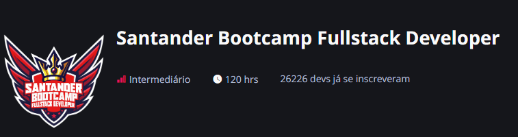

# Santander Bootcamp Fullstack Developer

##

Refazendo projeto de criação de uma API REST utilizando Spring com SpringBoot 

Integração com a API do VIACEP para pegar o endereço através de um cep e salvar os dados no banco H2.
